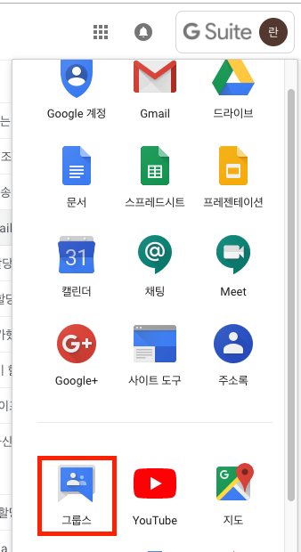
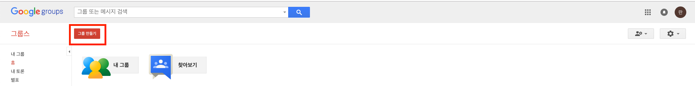

# 그룹 메일

## 생성

1. G Suite 계정으로 로그인 후 프로필 좌측의 메뉴를 클릭하세요. 

   

2. 메뉴에서 더보기를 클릭하여 '그룹스'를 클릭하세요.

3. 그룹스에 접속하여 '그룹 만들기' 버튼을 클릭합니다.

## 설정 

- 기본 권한 -> 게시 -> 웹상의 모든 사용자
- 엑세스 권한 -> 회원 보기 -> 그룹 소유자
- 엑세스 권한 -> 회원 보기 -> 그룹 소유자